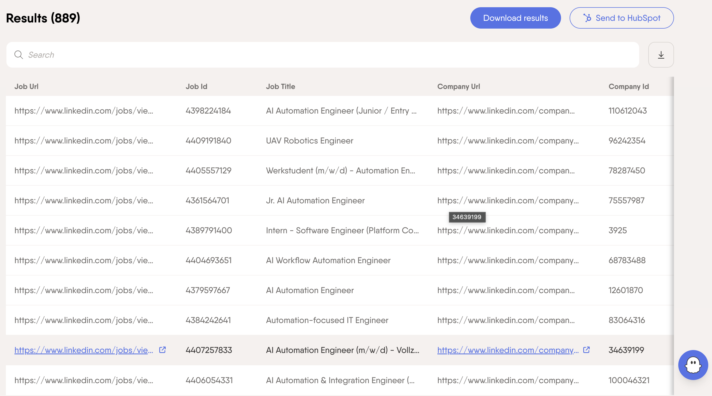
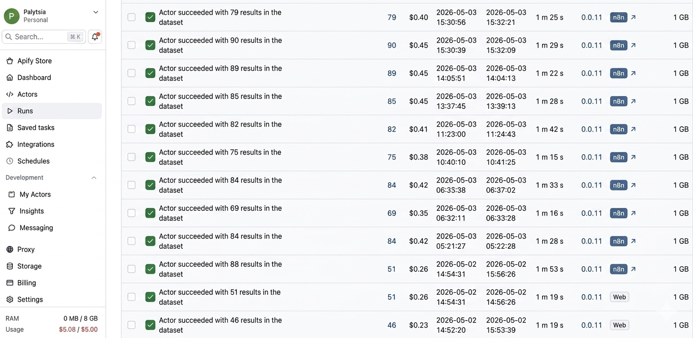

# LinkedIn Job Application Automation

**AI-powered system that finds, evaluates, and create personilized cover letter to relevant jobs on LinkedIn automatically.**

Built with **n8n** + LLMs + Apify + PhantomBuster.


## ✨ Features

- Dual scraper system (Apify + PhantomBuster fallback)
- Smart relevance scoring using LLMs (Gemini / Groq / OpenAI / Ollama / OpenRouter)
- Automatic personalized cover letter generation
- Deduplication via Google Sheets
- English language + remote filter
- Telegram / Gmail errors notifications

## 🛠 Tech Stack

- **Automation**: n8n
- **Scraping**: Apify, PhantomBuster
- **AI**: Gemini, OpenAI, Groq, Ollama (local), OpenRouter
- **Storage**: Google Sheets
- **Notifications**: Telegram, Gmail
- **Deployment**: n8n.cloud + self-hosted option

## 🚀 Quick Start

1. Import `workflow.json` into n8n
2. Fill in credentials (Apify, PhantomBuster, AI API, Telegram, Google)
3. Set schedule (every 3-4 hours recommended)
4. Run

See full setup guide → [`docs/setup-guide.md`](docs/setup-guide.md)

## 🎯 Project Goals

- Save 10+ hours per week on job applications
- Apply only to highly relevant positions (score ≥ 65)
- Demonstrate real AI automation skills to recruiters

## 📊 Results

- more than 900 jobs scraped
- almost 100 relevant positions found
- 50 personalized applications sent

## 💼 How this helps me get a job

This project showcases:

- Production-grade n8n workflow architecture
- Multi-agent LLM orchestration
- Web scraping + data processing pipelines
- Error handling and fallback systems
- Practical AI application in real life

## 📸 Screenshots





## Setup for self-hosted version on AWS

1. CLEAN PROJECT STRUCTURE

- EC2 (Amazon Linux): cd /home/ec2-user
- Create structure: mkdir -p n8n-files

🔐 FIX PERMISSIONS

```
sudo chown -R 1000:1000 /home/ec2-user/n8n-files
```

2. docker-compose.yml

```
services:
n8n:
image: docker.n8n.io/n8nio/n8n:latest
restart: unless-stopped

    ports:
      - "5678:5678"

    environment:
      - TZ=Europe/Oslo

      # cookie + http
      - N8N_SECURE_COOKIE=false

      # stable config
      - N8N_ENCRYPTION_KEY=some-random-long-string-change-this

      # important for webhooks later
      - N8N_HOST=http://EC2_PUBLIC_DNS
      - N8N_PORT=5678
      - WEBHOOK_URL=http://EC2_PUBLIC_DNS:5678/

    volumes:
      - /home/ec2-user/n8n-data:/home/node/.n8n
      - /home/ec2-user/n8n-files://home/node/.n8n-files
```

Replace:

N8N_ENCRYPTION_KEY=some-random-long-string-change-this

with:

```
openssl rand -hex 32
```

3. START CLEAN

```

docker compose up -d

```

4. CHECK STATUS

```

docker ps

```

5. LOCAL TEST ON SERVER

```

curl localhost:5678

```

Expected: HTML response (n8n UI)

6. OPEN IN BROWSER

http://EC2_PUBLIC_DNS:5678

7. ADD CONNECTION

- add all connection for necessary services
- add OAuth Redirect URL / Webhook URL from n8n into services settings
