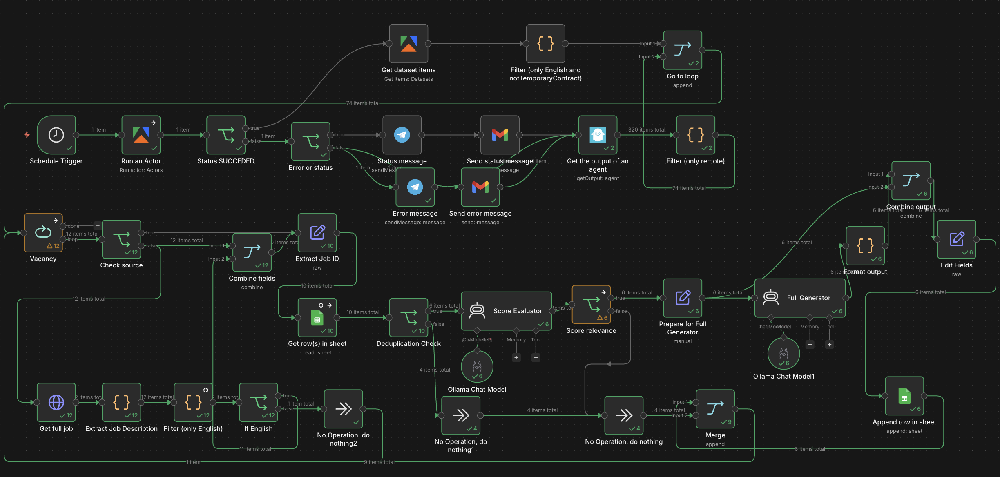
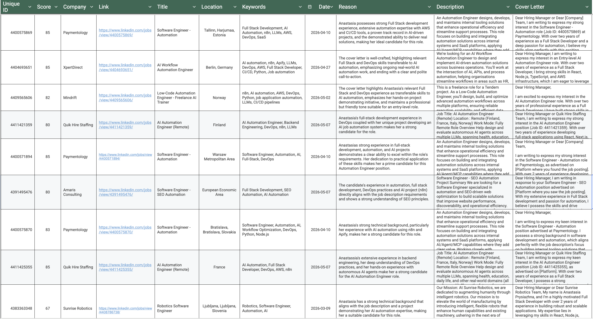
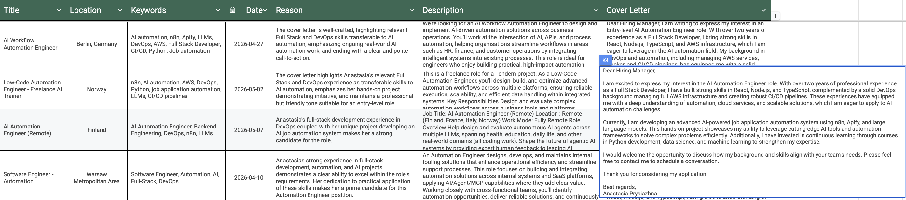
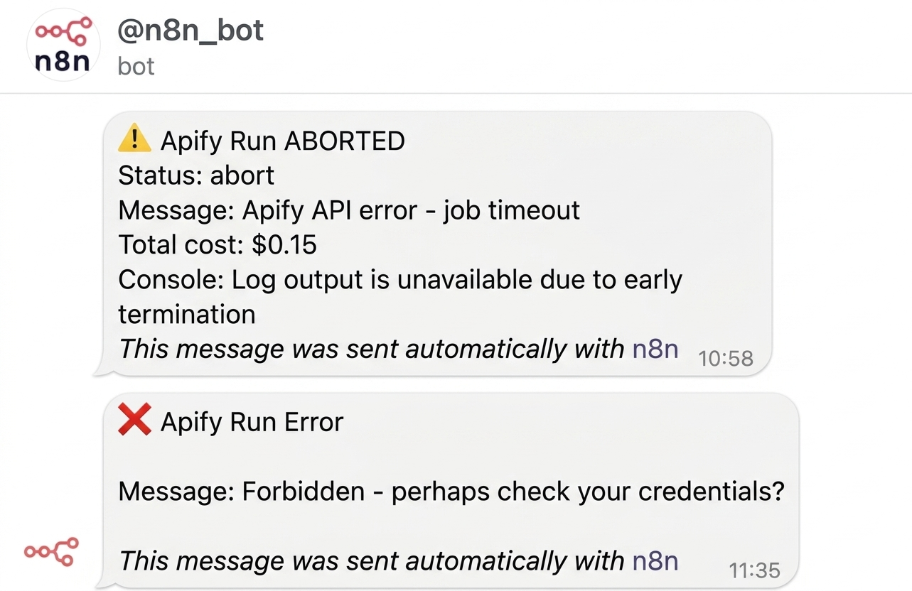
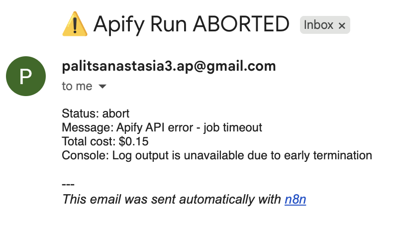
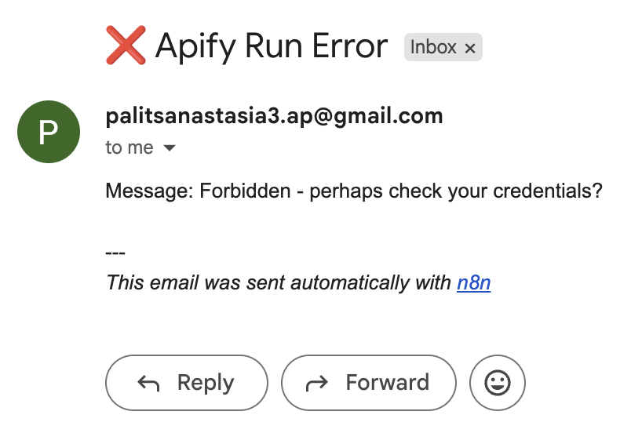

# LinkedIn Job Application Automation

**AI-powered system that finds, evaluates, and create personilized cover letter to relevant jobs on LinkedIn automatically.**

Built with **n8n** + LLMs + Apify + PhantomBuster.

## ✨ Features

- Dual scraper system (Apify + PhantomBuster fallback)
- Smart relevance scoring using LLMs (Gemini / Groq / OpenAI / Ollama / OpenRouter)
- Automatic personalized cover letter generation
- Deduplication via Google Sheets
- English language + remote filter
- Telegram / Gmail errors notifications

## 🛠 Tech Stack

- **Automation**: n8n
- **Scraping**: Apify, PhantomBuster
- **AI**: Gemini, OpenAI, Groq, Ollama (local), OpenRouter
- **Storage**: Google Sheets
- **Notifications**: Telegram, Gmail
- **Deployment**: n8n.cloud + self-hosted option

## 📸 Screenshots

## 🚀 Quick Start

1. Import `workflow.json` into n8n
2. Fill in credentials (Apify, PhantomBuster, AI API, Telegram, Google)
3. Set schedule (every 3-4 hours recommended)
4. Run

See full setup guide → [`docs/setup-guide.md`](docs/setup-guide.md)

## 🎯 Project Goals

- Save 10+ hours per week on job applications
- Apply only to highly relevant positions (score ≥ 65)
- Demonstrate real AI automation skills to recruiters

## 📊 Results 

- more than 900 jobs scraped
- almost 100 relevant positions found
- 50 personalized applications sent

## 💼 How this helps me get a job

This project showcases:
- Production-grade n8n workflow architecture
- Multi-agent LLM orchestration
- Web scraping + data processing pipelines
- Error handling and fallback systems
- Practical AI application in real life
